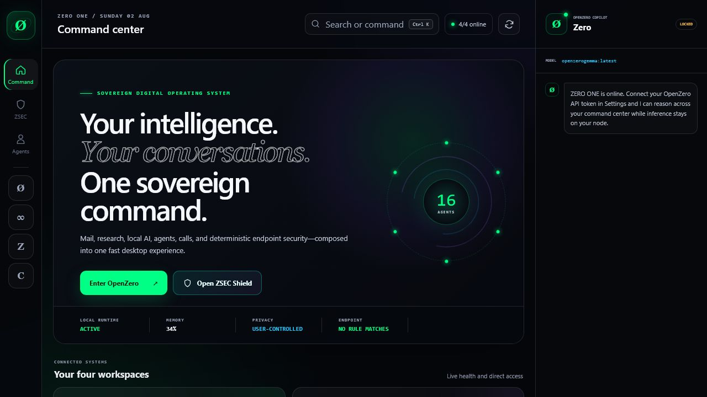
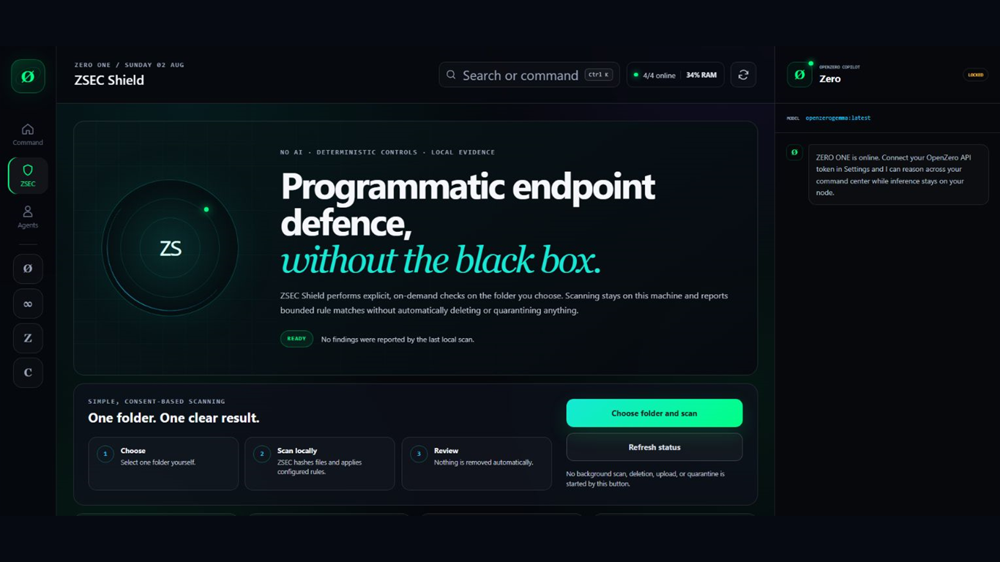

# ZERO ONE

<p align="center">
  
</p>

<p align="center"><strong>One private desktop command center for OpenZero, ZeroThink, ZMail, CallChat, ZSEC Shield, and ZMath Secure.</strong></p>

<p align="center">
  <a href="https://talktoai.org/ZeroOne/">Download</a> ·
  <a href="https://github.com/ResearchForumOnline/ZERO-ONE-Desktop/releases/latest">Latest release</a> ·
  <a href="docs/SECURITY_ARCHITECTURE.md">Security</a> ·
  <a href="docs/PRIVACY.md">Privacy</a>
</p>



ZERO ONE is an open-source Electron desktop shell for the TalkToAI ecosystem. It keeps connected products in isolated workspace sessions, talks to a user-configured OpenZero endpoint, and surfaces explicit local security controls without pretending an AI response or a UI badge is proof of protection.

## Download and install

ZERO ONE adapts from full desktop layouts down to compact 720 × 520 windows. Use the header zoom controls or `Ctrl +`, `Ctrl -`, and `Ctrl 0` to adjust the interface from 75% to 150%; embedded workspaces follow the same scale.

Use the authenticated [latest ZERO ONE release](https://github.com/ResearchForumOnline/ZERO-ONE-Desktop/releases/latest). No development tools are required.

| Platform | Package | Install |
|---|---|---|
| Windows 10/11 x64 | `ZERO-ONE-*-win-x64.exe` | Download the latest Windows installer from [Releases](https://github.com/ResearchForumOnline/ZERO-ONE-Desktop/releases/latest) |
| macOS Apple silicon | `ZERO-ONE-*-mac-arm64.dmg` | Open the disk image and drag ZERO ONE to Applications |
| Linux x64 | `ZERO-ONE-*-linux-x86_64.AppImage` | Make executable and open |
| Debian/Ubuntu x64 | `ZERO-ONE-*-linux-amd64.deb` | Open with the software installer or use `sudo apt install ./ZERO-ONE-*-linux-amd64.deb` |

Current source version is **0.6.4**. Published installers are unsigned public builds until Authenticode/notarization ships. Windows SmartScreen or macOS Gatekeeper may show an unknown-publisher warning. Verify downloads against `SHA256SUMS.txt` when present.

## What is included

- Four isolated workspaces with strict owned-origin navigation.
- Guided Assistant setup with private local Qwen 3 1.7B as the responsive default and optional branded OpenZero, OpenAI or Groq providers.
- A truthful automation surface that reports real endpoint reachability and permissions, not invented worker telemetry.
- OS-protected credential storage; insecure Linux fallback storage is refused.
- The matching native ZSEC Shield 0.1.2 selected-folder scanner on every published platform.
- ZMath Secure status for HTTPS/loopback transport, credential storage, and optional Windows BitLocker.
- Redacted diagnostics and consent-based camera/microphone access.



## First run

1. Open ZERO ONE and choose OpenZero, ZeroThink, ZMail or CallChat.
2. The default service addresses work without configuration. Add an OpenZero token in Settings only for authenticated copilot requests.
3. Open ZSEC Shield, choose one folder and review the local result. No background scan, deletion, upload or quarantine starts automatically.

## OpenZero: Local or Server

For most people, **Local** is the recommended mode. ZERO ONE connects to [Ollama](https://ollama.com/download) on this computer at its loopback API and uses `qwen3:1.7b` as the fast everyday default. It is approximately 1.4 GB and is run with thinking disabled for responsive chat. Prompts and responses stay between ZERO ONE and the local Ollama process unless the user deliberately opens or connects another service. Ollama is a separate runtime and model readiness must complete before local chat can work. See the official [Ollama quickstart](https://docs.ollama.com/quickstart) and [chat API documentation](https://docs.ollama.com/api/chat).

**Server** is the advanced mode for someone who already operates an OpenZero server. It requires that server's HTTPS address and desktop credential. Server mode can expose the orchestration, tools, skills and governed automation implemented by that OpenZero deployment.

The distinction matters: direct local Ollama mode provides private **model chat**. It does not by itself reproduce OpenZero's full server orchestration, browser control, tools, multi-step agents or remote skills. ZERO ONE labels the active mode and does not claim those capabilities when only the local model API is connected.

## Build from source

Requirements: Node.js 24 and npm.

```bash
git clone https://github.com/ResearchForumOnline/ZERO-ONE-Desktop.git
cd ZERO-ONE-Desktop
npm ci
npm run check
npm run dev
```

Platform packages are produced on their native operating systems by the pinned [release workflow](.github/workflows/release.yml).

## Open-core and security boundary

The desktop shell, security contracts, tests and build configuration are Apache-2.0 licensed. Unpublished ZMath research, experimental cipher implementations, production secrets, signing keys, server infrastructure and private datasets are not included.

ZERO ONE uses established TLS and operating-system cryptography. It reads Windows BitLocker status but never silently enables disk encryption or stores a recovery key. ZSEC Shield is an on-demand security companion—not certified antivirus, real-time prevention or guaranteed malware detection. Keep the operating system's built-in protection enabled.

See [ZMath Secure](docs/ZMATH_SECURE_BOUNDARY.md), [privacy](docs/PRIVACY.md), [security architecture](docs/SECURITY_ARCHITECTURE.md) and [release evidence](store/RELEASE_EVIDENCE.md).

## Licence

Apache License 2.0. ZERO ONE names, logos and product identity are not granted for confusing or impersonating distributions; see [TRADEMARKS.md](TRADEMARKS.md).
