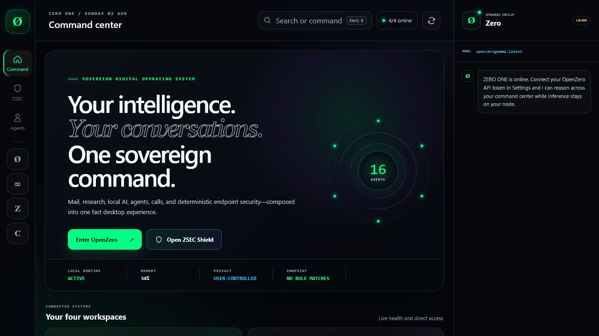
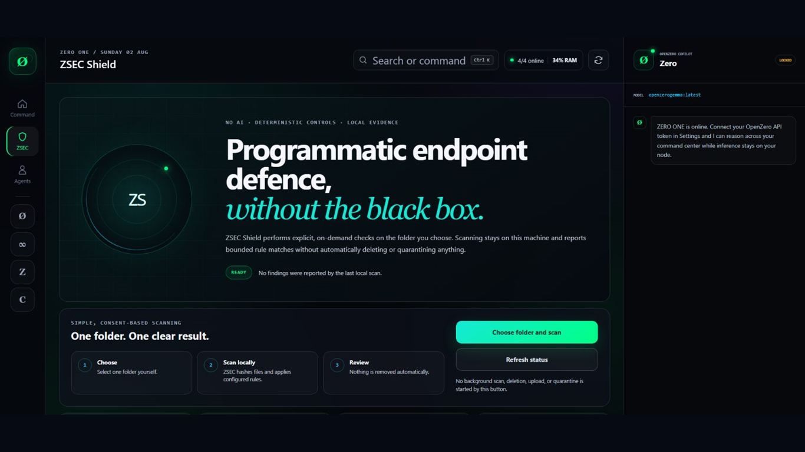

# ZERO ONE

<p align="center">
  
</p>

<p align="center"><strong>Private on-device ZNotes, local ZeroThink research, your OpenZero runtime, Browser Pilot, ZSEC Shield and ZMath Secure.</strong></p>

<p align="center">
  <a href="https://apps.microsoft.com/detail/9PMPR7PTW025">Microsoft Store</a> ·
  <a href="https://github.com/ResearchForumOnline/ZERO-ONE-Desktop/releases/latest">Latest release</a> ·
  <a href="docs/SECURITY_ARCHITECTURE.md">Security</a> ·
  <a href="docs/PRIVACY.md">Privacy</a>
</p>



ZERO ONE is an open-source Electron desktop shell for the TalkToAI ecosystem. It keeps connected products in isolated workspace sessions, talks to a user-configured OpenZero endpoint, and surfaces explicit local security controls without pretending an AI response or a UI badge is proof of protection.

## Download and install

ZERO ONE adapts from full desktop layouts down to compact 720 × 520 windows. Use the header zoom controls or `Ctrl +`, `Ctrl -`, and `Ctrl 0` to adjust the interface from 75% to 150%; embedded workspaces follow the same scale.

Use the authenticated [latest ZERO ONE release](https://github.com/ResearchForumOnline/ZERO-ONE-Desktop/releases/latest). No development tools are required.

| Platform | Package | Install |
|---|---|---|
| Windows 10/11 x64 | `ZERO-ONE-*-win-x64.exe` | Download the latest Windows installer from [Releases](https://github.com/ResearchForumOnline/ZERO-ONE-Desktop/releases/latest) |
| macOS Apple silicon | `ZERO-ONE-*-mac-arm64.dmg` | Open the disk image and drag ZERO ONE to Applications |
| Linux x64 | `ZERO-ONE-*-linux-x86_64.AppImage` | Make executable and open |
| Debian/Ubuntu x64 | `ZERO-ONE-*-linux-amd64.deb` | Open with the software installer or use `sudo apt install ./ZERO-ONE-*-linux-amd64.deb` |

Current source version is **8.1.0**. Published GitHub installers are also **8.1.0**. Microsoft Store 8.1.0.0 is submitted and in certification. This repair restores ZeroThink's chat/persona/memory/research workflows inside the desktop app, adds a native project agent and repairs ZNotes creation, autosave and encryption. See [8.1 release notes](store/RELEASE_NOTES_8.1.0.md) and the current [release receipt](docs/qa/RELEASE_8.1.0.md) for tests, package hashes and actual Store status. The preceding 8.0.0 Store-signed package was verified installed on this PC on 30 September 2026; changing source does not update that installation. Direct installers are unsigned until publisher signing ships. The direct updater accepts only a stable repository asset with matching GitHub digest and SHA256SUMS.

## What is included

- On-device ZNotes with saved note creation, autosave, checklists, pins, labels, colours, archive/trash and local imports/exports. Dual-key notebook protection uses independent authenticated encryption keys under OS custody.
- Built-in **ZeroThink Studio**: persistent conversations, follow-up context, a local source library, persona and memory, original Zero mode public briefs, research/review passes, optional web search and exports.
- **Native ZeroThink Agent**: choose a local project, inspect files, review proposed edits and approve commands. Tools return actual observations; the run reports unresolved errors and step-budget exhaustion. A user-approved command has normal OS permissions, not a container sandbox.
- A built-in Browser Pilot: one isolated tab, one user-granted task, a 12-step limit, structural snapshots that omit form values, secret/payment/file/CAPTCHA blocking, cross-site and consequential approval pauses, and an immediate stop-and-revoke control.
- Guided Assistant setup with private local OpenZero Gemma4 E2B as the recommended lightweight default and optional OpenZero server, OpenAI or Groq providers.
- A truthful automation surface that reports real endpoint reachability and permissions, not invented worker telemetry.
- OS-protected credential storage; insecure Linux fallback storage is refused.
- The matching native ZSEC Shield 0.1.2 selected-folder scanner on every published platform.
- ZMath Secure status for HTTPS/loopback transport, credential storage, and optional Windows BitLocker.
- Redacted diagnostics that exclude note content and credentials; embedded runtime camera/microphone access is denied.
- A visible update control that checks the official stable GitHub release, verifies the platform package against two matching SHA-256 records, and starts the installer only after the user approves.



## First run

1. Open ZNotes and write a note; it is encrypted on this device.
2. Open ZeroThink, import selected UTF-8 files or add selected ZNotes, and build an offline evidence map. Research model mode is optional. Model runs send bounded selected sources, conversation and your saved persona/latest explicit facts to the configured provider.
3. Configure your own OpenZero runtime address and token if you want runtime automation, or add your own OpenAI/Groq key for optional Assistant/ZeroThink chat. An optional Serper key enables labelled web snippets and opt-in automatic research.
4. Open ZSEC Shield, choose one folder and review the local result. No background scan, deletion, upload or quarantine starts automatically.

## ZeroThink local research

The workspace uses the open-source [ZeroThink engine and cross-platform CLI](https://github.com/ResearchForumOnline/ZeroThink), licensed Apache-2.0. The engine is vendored with its licence and provenance under `electron/zerothink/`. It searches selected documents, assigns inspectable source IDs, builds evidence maps and provides nine research processes. Optional model passes draft, critique and revise. Source-ID validation establishes whether a referenced excerpt exists, not whether a scientific claim is true.

Desktop limits are eight UTF-8 sources, one MiB each and two MiB total. Imports currently support TXT, Markdown, JSON and CSV; PDF extraction is not implemented. Session sources and results remain in memory unless a report is explicitly saved to encrypted ZNotes or exported. Exports are readable plaintext. The app never automatically scans folders or uploads private research to publish it.

Offline research needs no model, API key, hosted account, website or database. The Store edition supports an existing user-owned OpenZero endpoint or optional OpenAI/Groq keys for model passes. Direct builds also support existing local Ollama. There is no automatic switch from a local provider to a cloud provider. Research mode has no shell execution, weight editing or automatic computer control; Browser Pilot remains a separate user-granted task.

ZERO ONE 8.0.0 package and submission evidence is recorded in `docs/qa/RELEASE_8.0.0.md`. Previous releases do not establish certification of this version.

## Browser Pilot

Browser Pilot is included in ZERO ONE 7.9.2; there is no browser extension to install for the in-app workflow. Open **Browser Pilot**, navigate its dedicated isolated tab, describe one bounded task, and grant that tab. OpenZero plans one strict action at a time using page labels and structure. Passwords, payment fields, secret inputs, file inputs and CAPTCHA values are never included in the snapshot and cannot be operated by the pilot. Cross-site navigation, personal-data typing and consequential actions pause for an explicit one-time approval. Every run stops after 12 steps and the page overlay has a persistent STOP control.

The optional [OpenZero Tab Pilot for Chrome and Brave](https://chromewebstore.google.com/detail/openzero-tab-pilot/cgaalobjjknalamgchppccbocnhonhbf) remains available for people who want governed control in an existing external browser. Browsers deliberately require the user or an administrator to approve extension installation; ZERO ONE does not bypass that platform security boundary.

## Updates

ZERO ONE checks the official stable GitHub release shortly after launch, every six hours while open, and whenever **Settings → Check for updates** is pressed. An available compatible package can be installed with **Install verified update**. ZERO ONE requires an exact platform filename, official repository download URL, declared byte size, GitHub SHA-256 asset digest and a matching entry in `SHA256SUMS.txt`; it downloads to a private temporary file and refuses installation if any check differs. On Windows the verified one-click installer preserves the current user's settings, sessions and downloaded model data.

## OpenZero: Local or Server

For most people, **Local** is the recommended mode. ZERO ONE connects to [Ollama](https://ollama.com/download) on this computer at its loopback API and recommends the behavior-tested `OpenZero-Gemma4-E2B-Agentic-Q4_K_M` model for lightweight everyday chat (`hf.co/shafire/OpenZero-Gemma4-E2B-Agentic-GGUF:Q4_K_M`). The GGUF is approximately 3.4 GB and is run with thinking disabled for responsive chat. Prompts and responses stay between ZERO ONE and the local Ollama process unless the user deliberately opens or connects another service. Ollama is a separate runtime and model readiness must complete before local chat can work. See the official [Ollama quickstart](https://docs.ollama.com/quickstart), [chat API documentation](https://docs.ollama.com/api/chat), and the [verified OpenZero Gemma E2B model card](https://huggingface.co/shafire/OpenZero-Gemma4-E2B-Agentic-GGUF).

The model selector also offers the OpenZero Ministral 8B runtime edition for capable computers and legacy Gemma E4B compatibility. The rejected Fusion and Qwen3 1.7B releases are deliberately excluded from ZERO ONE local chat after response-quality testing. These are explicit choices: ZERO ONE does not silently replace a user-selected custom model.

**Server** is the advanced mode for someone who already operates an OpenZero server. It requires that server's HTTPS address and desktop credential. Server mode uses the runtime model reported by that server—currently the OpenZero Ministral 8B runtime edition in the standard deployment—and can expose the orchestration, tools, skills and governed automation implemented by that OpenZero deployment. The server model setting is separate from the lightweight local Assistant selection.

OpenZero is the agent runtime; ZERO ONE is the desktop command centre. A current OpenZero server can expose its **Recursive Lab** through ZERO ONE: Agent Zero stages source changes in a persistent isolated workspace, shows exact diffs, runs only operator-approved test profiles, and requires a fresh confirmation before atomic promotion or rollback. Direct local Ollama chat does not gain filesystem or self-modification authority.

The distinction matters: direct local Ollama mode provides private **model chat**. It does not by itself reproduce OpenZero's full server orchestration, browser control, tools, multi-step agents or remote skills. ZERO ONE labels the active mode and does not claim those capabilities when only the local model API is connected.

## Build from source

Requirements: Node.js 24 and npm.

```bash
git clone https://github.com/ResearchForumOnline/ZERO-ONE-Desktop.git
cd ZERO-ONE-Desktop
npm ci
npm run check
npm run dev
```

Platform packages are produced on their native operating systems by the pinned [release workflow](.github/workflows/release.yml).

## Open-core and security boundary

The desktop shell, security contracts, tests and build configuration are Apache-2.0 licensed. Unpublished ZMath research, experimental cipher implementations, production secrets, signing keys, server infrastructure and private datasets are not included.

ZERO ONE uses established TLS and operating-system cryptography. It reads Windows BitLocker status but never silently enables disk encryption or stores a recovery key. ZSEC Shield is an on-demand security companion—not certified antivirus, real-time prevention or guaranteed malware detection. Keep the operating system's built-in protection enabled.

See [ZMath Secure](docs/ZMATH_SECURE_BOUNDARY.md), [privacy](docs/PRIVACY.md), [security architecture](docs/SECURITY_ARCHITECTURE.md) and [release evidence](store/RELEASE_EVIDENCE.md).

## Licence

Apache License 2.0. ZERO ONE names, logos and product identity are not granted for confusing or impersonating distributions; see [TRADEMARKS.md](TRADEMARKS.md).
