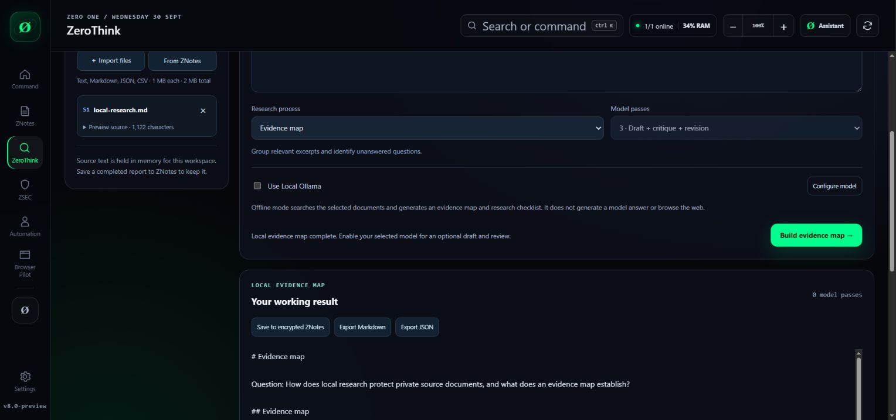

# ZERO ONE 8.0.0 release evidence

Recorded 30 September 2026. This record distinguishes source verification, packaging, Microsoft submission and public availability.

## Implemented scope

- Local ZeroThink workspace: nine processes, selected UTF-8 file and ZNotes imports, source previews, offline evidence maps, optional selected-provider draft/review/revision, progress, cancellation, encrypted ZNotes retention, Markdown/JSON exports.
- No company-hosted research login, database or subscription backend. Retired hosted mail/calling/account integrations are removed.
- Privileged IPC requires the main window, main frame and exact local renderer URL. Remote top-level main-window navigation is refused; isolated webview navigation retains its allowlist.
- Store edition refuses local model installation and uses Store-managed updates. Its optional model providers are an existing user-owned OpenZero server, OpenAI or Groq. Direct editions also support existing local Ollama.
- Embedded ZeroThink engine, templates, Apache-2.0 licence, notice and provenance match portable release commit `473a128c13798023bb719969c286204c12df60bd`.
- Git attributes preserve these five published files byte-for-byte even when Windows checkout enables automatic line-ending conversion. The provenance regression verifies all five release hashes.

## Verification completed

- `npm run check`: **46 Vitest tests and 56 Node tests passed**, followed by TypeScript, production Vite build and historical published-site consistency checks.
- Portable ZeroThink release: **36 tests passed on Windows, macOS and Ubuntu** in its independent repository.
- `npm audit`: **zero known reported vulnerabilities** at this check; this is not a guarantee against undiscovered defects.
- Real browser file picker imported the synthetic research fixture; the actual engine produced an offline source ledger and exported Markdown. Browser UI evidence is a development view, not a Store-signed installation or measured endpoint telemetry.
- Real Electron smoke executed the offline engine and OS safeStorage encryption/decryption using a disposable synthetic ZNote.
- Independent source review produced the privileged-navigation fix and four additional regression tests.
- Immutable Windows x64 ZSEC 0.1.2 payload verified: 89 files, 60 PE files, original entrypoint SHA-256 `6bc60026691fff00319e23c7ba9d49d1ab9f893715766177226062baa069d501`.
- Reviewed packaged ASAR contains version 8.0.0, Store marker, research engine/licences/provenance; main, preload and adapter bytes match the source. Production renderer has no development research route.
- Final Windows App Certification Kit run on the exact reviewed package: **OVERALL_RESULT=PASS**, version 8.0.0.0, full run, exit code0. Twenty-three tests passed; the optional static **Blocked executables** scan reports FAIL for process-launch API and executable-string references in stock Electron/Chromium and the pinned Python ZSEC runtime. This optional result is recorded rather than described as an all-tests pass; it does not change the kit's overall PASS and does not establish Microsoft certification.

## Exact Store candidate

File: `ZERO-ONE-8.0.0-win-x64.appx` in local `release/store-reviewed/`.

Size: **172764983 bytes**.

SHA-256: `113ecb98b691c47585842d1eb5165c6685902ca810316432fdab862468d3f3b2`.

This AppX is unsigned for Microsoft Store signing. It is not a sideload release.

| Embedded file | SHA-256 |
|---|---|
| main.cjs | c40ffd9242ff3d63c2846bf7985540b92fc16bee6be1836b16c8a647f241508c |
| preload.cjs | 8c63bd2c9d813c28c9a3391f3090c10066efb54c041672b367df2e673c4b1810 |
| zerothink-desktop.cjs | 0f159245f86794bd9b3aced78bed10e9f7990c756eadbae03085fbe5c7a872c0 |
| zerothink/engine.cjs | d0b1c0a9131e6cfad56f75aa8bba21b30219d8452761ba8c6beabc15f80d7498 |
| zerothink/PROVENANCE.json | b9f70483a419b6c06870c187f2c6075849c73b8743e95eee98245aec8f27e65d |

## Microsoft state

Product: **ZERO ONE Desktop**, `9PMPR7PTW025`.

Submission3: `1152921505702011222`. The reviewed 8.0.0 AppX was uploaded and displayed **Validated** in Partner Center. English UK listing, current privacy/support links and reviewer notes were saved. Microsoft accepted the submission, then passed certification. The latest Partner Center overview on 30 September 2026 shows **Update in publishing** and states: certification passed, publishing has started, and the product will be available shortly. Submission, preprocessing and certification are complete; publishing is in progress under the existing automatic schedule.

Microsoft certification of 8.0.0 is now established by Partner Center. Completed Store rollout and a Store-signed 8.0 installation have not been verified. Version7.9.6 was the live Store version before this update began publishing. Direct 8.0 Windows x64, macOS Apple Silicon and Linux x64 installers are already public at https://github.com/ResearchForumOnline/ZERO-ONE-Desktop/releases/tag/v8.0.0 .

Local proof of the submitted state is retained as `store-submitted-8.0.0.jpg`, and the certified publishing state as `store-publishing-8.0.0.jpg`; the source repository publishes this sanitized receipt instead of the Partner Center account screens.

## Cross-platform CI correction

The earlier Windows failure on commit `9a433e6` was a provenance-byte mismatch caused by Git automatic line-ending conversion. Commit `ab5eb1ba2b95ed5036bc78a6a699312da59bb6a9` preserves embedded release files with `-text` Git attributes and checks all five published hashes. Replacement [desktop-ci run](https://github.com/ResearchForumOnline/ZERO-ONE-Desktop/actions/runs/36734126343) passed Windows, macOS, Ubuntu and Windows packaging. The [v8.0 release workflow](https://github.com/ResearchForumOnline/ZERO-ONE-Desktop/actions/runs/36734515550) passed all seven jobs. The original failure remains historical evidence; it does not describe the corrected release.

Current public privacy policy: https://researchforumonline.github.io/OpenZero/zero-one-privacy.html . Support: https://github.com/ResearchForumOnline/ZERO-ONE-Desktop/issues . Offline research does not depend on either website.

## Practical limits

Eight UTF-8 sources maximum, one MiB each and two MiB total. No PDF extraction or live web research in this workspace. Model mode has one to three passes, a 3072-token total requested output budget, a 2048-token per-stage maximum and 120-second transport limit. There is no automatic provider fallback. Stop/Escape aborts an active request and future stages; it cannot retract material already sent.

Offline output is lexical source retrieval and a checklist, not model synthesis. Source-ID validation does not prove scientific truth. Exports are plaintext; encrypted retention uses ZNotes and OS encryption. No model-quality, AGI, unrestricted computer-control or weight-editing claim is made.

No credentials, private profiles, DNA data, customer records, database snapshots, signing keys or private research documents were included in publication. Raw certification reports and local build logs remain local.

